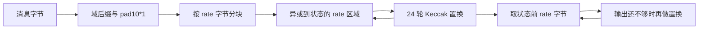

# FIPS 202：从 Keccak 置换到 SHA-3 / SHAKE

本练习先实现 `sha3` 包内共用的 [Keccak 核心](../sha3/keccak.go)，再测试 [`sha3` 包](../sha3/sha3.go)中的六种算法。10 个核心函数保留 TODO，六个公开入口已设置各自的 rate、域后缀和输出长度。

依据 **FIPS 202**（2015-08），见 [NIST 发布页](https://csrc.nist.gov/pubs/fips/202/final)和[官方 PDF](https://nvlpubs.nist.gov/nistpubs/FIPS/NIST.FIPS.202.pdf)。阅读时按此版本核对章节；勘误和后续修订信息以发布页为准。

## 本阶段的接口

输入与输出按整字节处理，全部采用 `Keccak-p[1600,24]`。四种 SHA-3 返回定长数组；SHAKE 的 `outputLen` 单位是**字节**，允许为 0，负数要求 panic。

| 包与入口 | rate（字节） | capacity（位） | 输出（字节） | 含首个填充位的后缀 |
| --- | --- | --- | --- | --- |
| `sha3.Sum224(data)` | 144 | 448 | 28 | `0x06` |
| `sha3.Sum256(data)` | 136 | 512 | 32 | `0x06` |
| `sha3.Sum384(data)` | 104 | 768 | 48 | `0x06` |
| `sha3.Sum512(data)` | 72 | 1024 | 64 | `0x06` |
| `sha3.SumSHAKE128(data, outputLen)` | 168 | 256 | 调用者指定 | `0x1f` |
| `sha3.SumSHAKE256(data, outputLen)` | 136 | 512 | 调用者指定 | `0x1f` |

统一导入 `github.com/erthoaers/cryptolab-golang/sha3`。定长摘要常量为 `Size224/256/384/512`；各变体的 rate 常量为 `BlockSize224/256/384/512` 和 `BlockSizeSHAKE128/256`，单位均为字节。

依据 §6.1–6.2，所有配置满足 `8*rate + capacity = 1600`。SHAKE128 / SHAKE256 名称中的数字不规定输出长度。SHA3-256 与旧 Keccak-256 的域后缀不同，不能用旧 Keccak 的摘要当作 SHA3-256 答案。

本阶段只有一次性 `Sum`，尚无 `hash.Hash`、流式 `Write/Read` 或状态序列化接口。非整字节消息/输出、其他宽度或轮数的 Keccak-p、RawSHAKE 入口、SP 800-185 的 cSHAKE/KMAC 以及 Rust 版留待后续；因此本练习只覆盖 FIPS 202 的整字节子集。

## 先建立数据表示

SHA-3 的状态是 **25 条 64 位 lane**，合计 1600 位，即 200 字节。源码用 `[25]uint64`，坐标 `(x,y)` 放在 `a[x+5*y]`；`z` 对应该整数的第 z 位。字节进入 lane 时使用**小端**，不要沿用 SHA-2 消息字的大端装载。

海绵函数由吸收和挤出两阶段组成：



图中吸收循环每次消费一个输入块；全部输入块完成后才进入输出阶段。capacity 区域参与置换，但不直接接收消息异或，也不直接输出。输入恰好占满 rate 时，还需要一个独立的填充块。

## 五步练习

以下命令均在 `cryptolab-golang/` 执行。测试恢复带类型的 TODO panic，并将它记为失败；不会跳过未实现步骤。

### K-01：字节与状态转换

实现 `decodeState` / `encodeState`，阅读 §§3.1.2–3.1.3 和附录 B.1。可以用 `encoding/binary.LittleEndian`，先确认 8 字节一组与 `x+5*y` 对应关系。两个方向的测试各有独立构造的期望值，不会让一对互相抵消的错误通过。

```sh
go test ./sha3 -run '^Test(DecodeState|EncodeState)$' -count=1 -v
```

### K-02：五个轮步骤

按顺序实现 `theta` → `rho` → `pi` → `chi` → `iota`，对应 §§3.2.1–3.2.5。

| 步骤 | 关注点 | 常见错误 |
| --- | --- | --- |
| θ | 先计算全部列奇偶值，再更新状态 | 在计算后续列时读到已经改写的值 |
| ρ | lane 内循环左移，位移量取模 64 | 用普通移位；把标准表的 x/y 方向读反 |
| π | 改变 lane 的位置，lane 内位序不变 | 混淆源坐标与目标坐标；原地覆盖尚未搬走的 lane |
| χ | 按行做非线性组合 | 未保存原始行就顺序写回 |
| ι | 只改 lane `(0,0)`，常数随轮号变化 | 首轮编号错误；常数装载端序错误 |

可以用 `math/bits.RotateLeft64`，不要调用现成的 Keccak 置换。ι 的轮常数按 Algorithm 5/6 推导，也可以保存推导后的 24 项表。对 Go 的 `%` 要留意：负数的余数仍可能为负，循环坐标可先加 5 再取模。

```sh
go test ./sha3 -run '^TestTheta$' -count=1 -v
go test ./sha3 -run '^Test(Rho|Pi|Chi|Iota)$' -count=1 -v
```

每一步都有 24 轮官方中间状态。测试直接注入该步的官方输入，不依赖前一步的实现，因此可以定位到具体的轮和变换。

### K-03：组装 24 轮置换

实现 `permute`，阅读 §3.3。本练习固定 `b=1600`、`nr=24`，轮号是 0–23；每轮顺序为 θ、ρ、π、χ、ι。只有 ι 接收轮号。

```sh
go test ./sha3 -run '^TestPermute$' -count=1 -v
```

### K-04：最后一块的填充

实现 `padTail`，阅读 §5.1 与附录 B.2 表 6。调用前完整块已被吸收，`tail` 长度必须小于 rate。分配新的 rate 字节块，保留尾部消息，加入域分隔与 `pad10*1`；不能用输入的备用容量存放填充。

当剩余空间只有 1 字节时，SHA-3 最后一个字节是 `0x86`，SHAKE 是 `0x9f`；两个标记必须落在同一个字节。标准中的 SHA-3 域后缀是按位写的 `01`；`0x06` 已包含首个填充位，不能把它当作普通十六进制 `0x01`。

```sh
go test ./sha3 -run '^TestPadTail$' -count=1 -v
```

覆盖五种 rate、两种后缀、空尾部，以及剩余 1/2/3 字节的情况。`padTail` 的参数由内部调用者保证合法；包内共享函数 `sponge` 负责拒绝非法参数。

### K-05：吸收与挤出

实现 `sponge`，阅读 §4 Algorithm 8、§5.2、§6。先处理输入完整块，再处理填充尾块。每次仅将 rate 区域与输入块异或，随后调用置换。输出超过一个 rate 时，需要继续置换并取出下一个 rate，直到满足长度。

不要复制整个消息来追加填充；用固定状态和一个尾块即可。对输入、输入备用容量、跨调用状态和返回切片所有权的测试都已准备。

```sh
go test ./sha3 -run '^TestSponge' -count=1 -v
go test ./sha3 -run '^TestSum256' -count=1 -v
go test ./sha3 -count=1
```

先通过 SHA3-256，再检查其余配置。SHAKE 测试包含输出长度 0、rate−1、rate、rate+1、2×rate+1，并检查同一消息的短输出是长输出的前缀。

## 向量与验收边界

从 [NIST CAVP](https://csrc.nist.gov/projects/cryptographic-algorithm-validation-program/secure-hashing) 的 2016-01、CAVS 19.0 字节向量选取 **73 组**：四种 SHA-3 各 10 组，SHAKE128 为 15 组，SHAKE256 为 18 组。包含空消息、短消息、rate 边界、长消息与可变输出。每项 JSON 记录原始 `.rsp` 名称及 `Len` 或 `COUNT`。这是选集，未运行压缩包中的全部记录或 Monte Carlo 测试。

Keccak 的 120 个步骤状态来自 NIST [SHA3-256_Msg0.pdf](https://csrc.nist.gov/CSRC/media/Projects/Cryptographic-Standards-and-Guidelines/documents/examples/SHA3-256_Msg0.pdf)，另含初始与最终状态。六种算法的向量与 Keccak 中间状态 JSON 全部放在 `sha3/testdata/`；六种算法的文件按算法命名，中间状态文件为 `nist_sha3_256_empty.json`；测试函数用 `TestSum224...`、`TestSumSHAKE128...` 等前缀区分。自建边界数据与 Go `crypto/sha3` 的差分结果在测试注释中另作说明；标准库只出现在测试里。

```sh
# 编译检查：不执行算法
go test ./... -run '^$' -count=1

# 夹具核对：不执行 TODO，不能当作算法通过
go test ./sha3 -run '^Test.*VectorFixtures$' -count=1

# 完成所有核心函数后，执行本阶段完整验收
go test ./sha3 -count=1
go vet ./sha3
```

`Test.*VectorFixtures` 检查仓库内 JSON 的结构和固定摘要；它不运行核心算法，也不逐项核对原始 PDF 中的所有中间状态。`TestTheta` 至 `TestIota` 则将每一步实现的结果与 JSON 中的官方中间状态比较。核查转录时，应直接对照上述 NIST 示例 PDF。

完成本阶段后，再增加 SHA-3 的 `hash.Hash` 接口和 SHAKE 的持续输出接口，专门测试分段写入、分段读取、`Sum` 不改变状态，以及开始挤出后的写入策略。
