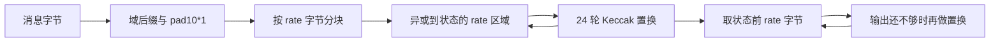

# FIPS 202：从 Keccak 置换到 SHA-3 / SHAKE

本练习按 SHA-2 的方式组织流式接口：四种 SHA-3 实现 `hash.Hash`，两种 SHAKE 实现 `hash.XOF`，六个一次性 `Sum…` 入口复用流式接口。构造、参数检查、元数据、`Reset` 和包装已接好；9 个底层步骤，以及流式吸收、持续挤出、摘要快照共 **12 个算法 TODO** 留给你完成。

依据 **FIPS 202**（2015-08），见 [NIST 发布页](https://csrc.nist.gov/pubs/fips/202/final)和[官方 PDF](https://nvlpubs.nist.gov/nistpubs/FIPS/NIST.FIPS.202.pdf)。阅读时按此版本核对章节；勘误和后续修订信息以发布页为准。

## 文件与标准接口

| 文件 | 职责 |
| --- | --- |
| [sha3.go](../sha3/sha3.go) | `digest`、四个 `New…`、`hash.Hash` 方法与定长 `Sum…` |
| [shake.go](../sha3/shake.go) | `shake`、两个 `NewSHAKE…`、`hash.XOF` 方法与 `SumSHAKE…` |
| [sponge.go](../sha3/sponge.go) | 两类接口共用的海绵状态、分段吸收与持续挤出 |
| [keccak.go](../sha3/keccak.go) | lane 编解码、五步变换、置换、尾块填充 |
| [hash_test.go](../sha3/hash_test.go)、[xof_test.go](../sha3/xof_test.go) | 流式接口的行为与边界测试 |
| 原有 `*_test.go`、`testdata/` | 保留底层步骤、六种一次性入口、官方向量与中间状态测试 |

本项目的构造函数与 SHA-2 一样，直接返回标准接口。接口契约依据本机 Go 1.27.1 的 [hash.Hash](https://pkg.go.dev/hash#Hash)、[hash.XOF](https://pkg.go.dev/hash#XOF)及 [crypto/sha3](https://pkg.go.dev/crypto/sha3)。`crypto.Hash` 是算法标识类型；这里需要实现的方法定义在 `hash` 包。

| 类别 | 构造入口 | 方法 |
| --- | --- | --- |
| 固定摘要 | `New224/256/384/512() hash.Hash` | `Write`、`Sum`、`Reset`、`Size`、`BlockSize` |
| 可扩展输出 | `NewSHAKE128/256() hash.XOF` | `Write`、`Read`、`Reset`、`BlockSize` |

下面是算法完成后的调用方式；当前执行 `Write`、`Read` 或 `Sum` 会遇到对应练习 TODO。

```go
h := sha3.New256()
h.Write([]byte("ab"))
first := h.Sum(nil) // "ab" 的摘要；保留原状态
h.Write([]byte("c"))
second := h.Sum(nil) // "abc" 的摘要
_, _ = first, second

x := sha3.NewSHAKE128()
x.Write([]byte("abc"))
a, b := make([]byte, 32), make([]byte, 64)
x.Read(a)
x.Read(b) // 接着取第 33–96 字节
x.Reset() // 之后可以重新 Write
```

`hash.Hash.Sum(b)` 在 b 后追加摘要，保留前缀和原始状态；调用之后仍可继续写入。`hash.XOF.Read(p)` 消耗输出流，每次接着上一次的位置读。两种 SHAKE 读取时填满 p 并返回 `len(p), nil`，不会耗尽而返回 EOF。

SHAKE 第一次 `Read` 进入挤出阶段，之后任何 `Write`（包括空写入）都必须 panic；`Reset` 才恢复吸收阶段。零长度 `Read(nil)` 也切换阶段，这与本机 Go 1.27.1 的 `crypto/sha3` 行为一致，已有专门测试。空 `Write` 在吸收阶段返回 `0, nil`。

## 六种配置

输入与输出按整字节处理，全部采用 `Keccak-p[1600,24]`。四种 SHA-3 返回定长数组；SHAKE 的 `outputLen` 单位是**字节**，允许为 0，负数要求 panic。

| 包与入口 | rate（字节） | capacity（位） | 输出（字节） | 含首个填充位的后缀 |
| --- | --- | --- | --- | --- |
| `sha3.Sum224(data)` | 144 | 448 | 28 | `0x06` |
| `sha3.Sum256(data)` | 136 | 512 | 32 | `0x06` |
| `sha3.Sum384(data)` | 104 | 768 | 48 | `0x06` |
| `sha3.Sum512(data)` | 72 | 1024 | 64 | `0x06` |
| `sha3.SumSHAKE128(data, outputLen)` | 168 | 256 | 调用者指定 | `0x1f` |
| `sha3.SumSHAKE256(data, outputLen)` | 136 | 512 | 调用者指定 | `0x1f` |

统一导入 `github.com/erthoaers/cryptolab-golang/sha3`。定长摘要常量为 `Size224/256/384/512`；各变体的 rate 常量为 `BlockSize224/256/384/512` 和 `BlockSizeSHAKE128/256`，单位均为字节。

依据 §6.1–6.2，所有配置满足 `8*rate + capacity = 1600`。SHAKE128 / SHAKE256 名称中的数字不规定输出长度。SHA3-256 与旧 Keccak-256 的域后缀不同，不能用旧 Keccak 的摘要当作 SHA3-256 答案。

本阶段覆盖字节级一次性与流式接口。`hash.Cloner`、二进制状态序列化、非整字节消息/输出、其他宽度或轮数的 Keccak-p、RawSHAKE 入口、SP 800-185 的 cSHAKE/KMAC 以及 Rust 版留待后续。当前公开类型是接口，具体状态类型保留在包内。

## 先建立数据表示

SHA-3 的状态是 **25 条 64 位 lane**，合计 1600 位，即 200 字节。源码用 `[25]uint64`，坐标 `(x,y)` 放在 `a[x+5*y]`；`z` 对应该整数的第 z 位。字节进入 lane 时使用**小端**，不要沿用 SHA-2 消息字的大端装载。

海绵函数由吸收和挤出两阶段组成：



图中吸收循环每次消费一个输入块；全部输入块完成后才进入输出阶段。capacity 区域参与置换，但不直接接收消息异或，也不直接输出。输入恰好占满 rate 时，还需要一个独立的填充块。

## 七步练习

以下命令均在 `cryptolab-golang/` 执行。测试恢复带类型的 TODO panic，并将它记为失败；不会跳过未实现步骤。

### K-01：字节与状态转换

实现 `decodeState` / `encodeState`，阅读 §§3.1.2–3.1.3 和附录 B.1。可以用 `encoding/binary.LittleEndian`，先确认 8 字节一组与 `x+5*y` 对应关系。两个方向的测试各有独立构造的期望值，不会让一对互相抵消的错误通过。

```sh
go test ./sha3 -run '^Test(DecodeState|EncodeState)$' -count=1 -v
```

### K-02：五个轮步骤

按顺序实现 `theta` → `rho` → `pi` → `chi` → `iota`，对应 §§3.2.1–3.2.5。

| 步骤 | 关注点 | 常见错误 |
| --- | --- | --- |
| θ | 先计算全部列奇偶值，再更新状态 | 在计算后续列时读到已经改写的值 |
| ρ | lane 内循环左移，位移量取模 64 | 用普通移位；把标准表的 x/y 方向读反 |
| π | 改变 lane 的位置，lane 内位序不变 | 混淆源坐标与目标坐标；原地覆盖尚未搬走的 lane |
| χ | 按行做非线性组合 | 未保存原始行就顺序写回 |
| ι | 只改 lane `(0,0)`，常数随轮号变化 | 首轮编号错误；常数装载端序错误 |

可以用 `math/bits.RotateLeft64`，不要调用现成的 Keccak 置换。ι 的轮常数按 Algorithm 5/6 推导，也可以保存推导后的 24 项表。对 Go 的 `%` 要留意：负数的余数仍可能为负，循环坐标可先加 5 再取模。

```sh
go test ./sha3 -run '^TestTheta$' -count=1 -v
go test ./sha3 -run '^Test(Rho|Pi|Chi|Iota)$' -count=1 -v
```

每一步都有 24 轮官方中间状态。测试直接注入该步的官方输入，不依赖前一步的实现，因此可以定位到具体的轮和变换。

### K-03：组装 24 轮置换

实现 `permute`，阅读 §3.3。本练习固定 `b=1600`、`nr=24`，轮号是 0–23；每轮顺序为 θ、ρ、π、χ、ι。只有 ι 接收轮号。

```sh
go test ./sha3 -run '^TestPermute$' -count=1 -v
```

### K-04：最后一块的填充

实现 `padTail`，阅读 §5.1 与附录 B.2 表 6。调用前完整块已被吸收，`tail` 长度必须小于 rate。分配新的 rate 字节块，保留尾部消息，加入域分隔与 `pad10*1`；不能用输入的备用容量存放填充。

当剩余空间只有 1 字节时，SHA-3 最后一个字节是 `0x86`，SHAKE 是 `0x9f`；两个标记必须落在同一个字节。标准中的 SHA-3 域后缀是按位写的 `01`；`0x06` 已包含首个填充位，不能把它当作普通十六进制 `0x01`。

```sh
go test ./sha3 -run '^TestPadTail$' -count=1 -v
```

覆盖五种 rate、两种后缀、空尾部，以及剩余 1/2/3 字节的情况。`padTail` 的参数由内部调用者保证合法；`newSponge` 已检查 rate 与后缀，一次性包装已检查负输出长度。

### K-05：流式吸收与 Write

实现 [spongeState.write](../sha3/sponge.go)，阅读 §4 Algorithm 8 的吸收部分。`digest.Write` 和 `shake.Write` 都委托给它：接受任意长度的分段输入，处理完整 rate 块，复制并保留不足一块的尾部。只更新 rate 区域的输入异或，capacity 区域仍参与置换。

状态里的 `lanes` 保存 25 条通道；吸收时 `buffer[:offset]` 保存尚未吸收的尾部。`rate` 与 `suffix` 由构造函数设置，`squeezing` 标记当前阶段。结构只含数组与标量，复制整个结构时没有共享的切片底层存储。

成功写入必须返回 `len(p), nil`，不得修改或保留调用方输入；进入挤出阶段后，即使 p 为空也拒绝写入。保持固定大小状态与尾块，不要保存整条消息。

```sh
go test ./sha3 -run '^Test(Hash|XOF)WriteContract$' -count=1 -v
```

这组测试先核对写入计数和输入不被修改；吸收结果是否正确，需要完成 K-06 后运行 XOF 向量与边界测试。

### K-06：收尾与持续 Read

实现 [spongeState.read](../sha3/sponge.go)，阅读 §4 Algorithm 8 的挤出部分、§5.1、§6.2 和附录 A.2。第一次读先按域后缀和 `pad10*1` 收尾并完成置换；即使之前输入恰好是 rate 的整数倍，仍有额外填充块。后续读继续挤出，不再填充。

挤出时 `buffer[offset:rate]` 表示当前块尚未读取的字节。读取跨越 rate 边界时继续置换，新的输出必须与一次性 SHAKE 输出拼接一致。`Read(nil)` 进入挤出阶段但不消费输出字节；重复空读也不消费字节。所有合法读取填满输出切片，只写入该切片长度范围。

```sh
go test ./sha3 -run '^TestXOF' -count=1 -v
go test ./sha3 -run '^Test(Sponge|SumSHAKE)' -count=1 -v
```

`Reset` 已接好：清空状态、尾块、偏移和阶段，保留算法配置。测试覆盖吸收途中、空读之后、部分输出和跨块输出后的复用。

### K-07：Hash.Sum 的独立快照

实现 [digest.Sum](../sha3/sha3.go)，与 SHA-2 中复制 digest 后调用 `checkSum` 的思路一致。复制当前海绵状态，在副本上收尾并取出该变体的 `size` 字节，再追加到 b；原对象仍处于吸收阶段，可以继续 `Write`。

注意返回切片要保留 b 的前缀，既要处理容量足够，也要处理追加时重新分配的情况。改变返回的摘要内容，不得影响原状态或后续 `Sum`。空消息的 `Sum` 同样不能让原对象进入挤出阶段。

```sh
go test ./sha3 -run '^TestHash' -count=1 -v
go test ./sha3 -run '^TestSum(224|256|384|512)' -count=1 -v
go test ./sha3 -count=1
```

一次性 `Sum224/256/384/512` 通过 `New… → Write → Sum` 完成；`SumSHAKE128/256` 通过 `NewSHAKE… → Write → Read` 完成。原 `TestSponge` 的调用入口现在也是同一流式状态的包装，不需要另写第二套吸收和挤出算法。

## 向量与验收边界

从 [NIST CAVP](https://csrc.nist.gov/projects/cryptographic-algorithm-validation-program/secure-hashing) 的 2016-01、CAVS 19.0 字节向量选取 **73 组**：四种 SHA-3 各 10 组，SHAKE128 为 15 组，SHAKE256 为 18 组。包含空消息、短消息、rate 边界、长消息与可变输出。每项 JSON 记录原始 `.rsp` 名称及 `Len` 或 `COUNT`。这是选集，未运行压缩包中的全部记录或 Monte Carlo 测试。

Keccak 的 120 个步骤状态来自 NIST [SHA3-256_Msg0.pdf](https://csrc.nist.gov/CSRC/media/Projects/Cryptographic-Standards-and-Guidelines/documents/examples/SHA3-256_Msg0.pdf)，另含初始与最终状态。六种算法的向量与 Keccak 中间状态 JSON 全部放在 `sha3/testdata/`；六种算法的文件按算法命名，中间状态文件为 `nist_sha3_256_empty.json`；测试函数用 `TestSum224...`、`TestSumSHAKE128...` 等前缀区分。自建边界数据与 Go `crypto/sha3` 的差分结果在测试注释中另作说明；标准库只出现在测试里。

```sh
# 编译检查：不执行算法
go test ./... -run '^$' -count=1

# 夹具核对：不执行 TODO，不能当作算法通过
go test ./sha3 -run '^Test.*VectorFixtures$' -count=1

# 完成所有核心函数后，执行本阶段完整验收
go test ./sha3 -count=1
go vet ./sha3
```

`Test.*VectorFixtures` 检查仓库内 JSON 的结构和固定摘要；它不运行核心算法，也不逐项核对原始 PDF 中的所有中间状态。`TestTheta` 至 `TestIota` 则将每一步实现的结果与 JSON 中的官方中间状态比较。核查转录时，应直接对照上述 NIST 示例 PDF。

新增流式测试仍使用相同的 73 组固定答案，并用 Go 标准库核对分段输入、连续输出、`Sum` 前缀/状态、`Reset`、实例独立性、内存所有权，以及 `io.Copy`、`io.LimitReader`、`io.ReadFull` 的组合行为。读写阶段错误单独测试，TODO panic 不能算作正确拒绝。

只检查接口构造与元数据，可运行 `go test ./sha3 -run '^Test(Hash|XOF)Metadata$' -count=1`；通过并不代表算法完成。全部 12 个 TODO 完成后，以未过滤的 `go test ./sha3 -count=1` 为本阶段算法验收入口。
