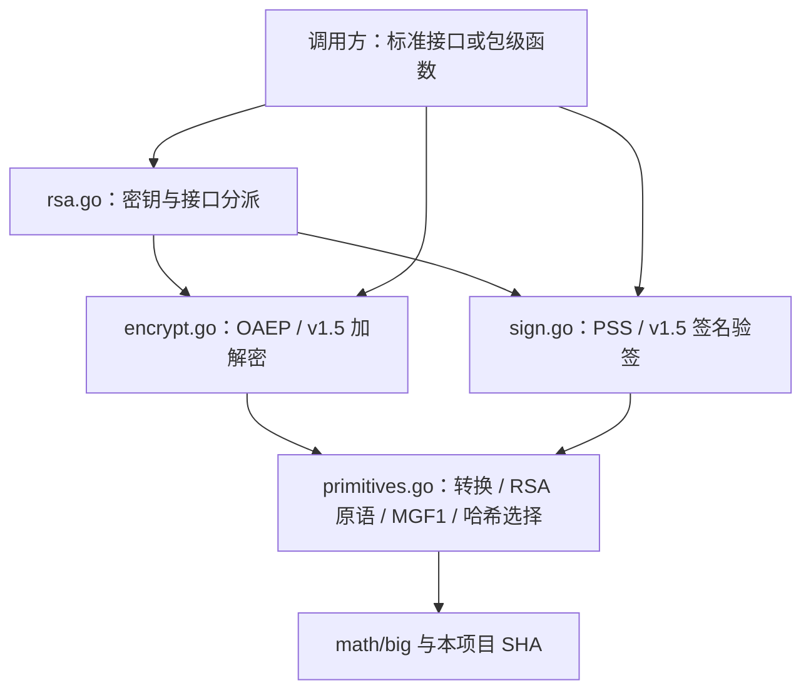

# RSA：对接 Go 的公钥密码接口

本包按 **RFC 8017 / PKCS #1 v2.2**（2016-11） 实现两素数 RSA，使用 **Go 1.27.1 的 `crypto.Signer` 和 `crypto.Decrypter`** 作为外部接口。整数转换、密钥构造与验证、CRT 预计算、整数原语、哈希选择和 MGF1 已有实现；OAEP、PSS、PKCS#1 v1.5 和随机密钥生成仍保留 TODO。

私钥通过标准接口提供签名、解密方法；加密和验签使用包级函数。学习顺序从整数表示开始，再连接编码方案和 Go 接口。

参考入口：[Go crypto](https://pkg.go.dev/crypto@go1.27.1)、[Go crypto/rsa](https://pkg.go.dev/crypto/rsa@go1.27.1)、[RFC 8017](https://www.rfc-editor.org/rfc/rfc8017.html)、[FIPS 186-5](https://csrc.nist.gov/pubs/fips/186-5/final)、[SP 800-56B Rev. 2](https://csrc.nist.gov/pubs/sp/800/56/b/r2/final)。RFC 8017 规定整数原语和编码方案，后两份标准用于学习密钥生成与验证。

## 外部接口与分派

[`rsa.go`](../rsa/rsa.go) 提供编译期接口断言，私钥具有以下方法：

```go
func (priv *PrivateKey) Public() crypto.PublicKey
func (priv *PrivateKey) Sign(random io.Reader, digest []byte, opts crypto.SignerOpts) ([]byte, error)
func (priv *PrivateKey) Decrypt(random io.Reader, ciphertext []byte, opts crypto.DecrypterOpts) ([]byte, error)
```

RSA 的 `Sign` 接收**已经计算好的摘要**。调用者负责选择摘要算法；`opts` 同时决定签名方案。不能把原始消息直接交给 SHA-256 模式的 `Sign`。

| 调用及选项 | 实际入口 | 要点 |
| --- | --- | --- |
| `Sign(..., &PSSOptions{...})` | `SignPSS` | `Hash` 必填；支持自动、等于摘要长度和指定长度的盐 |
| `Sign(..., crypto.SHA256)` 或其他 `SignerOpts` | `SignPKCS1v15` | 使用 `HashFunc()`；摘要不再重复哈希 |
| `Decrypt(..., &OAEPOptions{...})` | OAEP 解密 | `Hash`、`MGFHash`、`Label` 都有意义；`MGFHash=0` 表示与 `Hash` 相同 |
| `Decrypt(..., nil)` 或 `SessionKeyLen<=0` 的 v1.5 选项 | `DecryptPKCS1v15` | 跟随标准库的旧方案默认值；要用 OAEP 就显式传选项 |
| `Decrypt(..., &PKCS1v15DecryptOptions{SessionKeyLen: n})`，`n>0` | 会话密钥解码 | 先生成随机后备密钥；填充或明文长度不符时保留后备值 |

接口层只负责分派。OAEP、PSS、v1.5 编码与 RSA 运算在本包完成。`nil` 签名选项、已知类型的 typed-nil 选项和未知解密选项返回 `ErrInvalidOptions`；这部分 nil 处理比标准库更明确。

公钥使用 `type PublicKey = crypto/rsa.PublicKey`，选项、PSS 常量和三个方案错误值也复用标准库。这样 `Public()` 的动态类型就是 `*crypto/rsa.PublicKey`，标准验签器和 `x509` 能识别它。这里只复用数据表示、`Size`／`Equal` 等元数据行为，RSA 算法在本包实现。

## 文件与依赖方向

整个 `rsa` 包以 PKCS #1 v2.2 为规范，源码按职责统一划分。加密文件包含 OAEP 和 v1.5 两套加密方案，签名文件包含 PSS 和 v1.5 两套签名方案；方案名称保留在函数名中。共用的 MGF1 和哈希选择与整数原语集中放置。

| 源码 | 对应测试 | 职责 |
| --- | --- | --- |
| [rsa.go](../rsa/rsa.go) | [rsa_test.go](../rsa/rsa_test.go) | 公私钥、选项、错误、构造与生成、验证与预计算、`Public`／`Equal`、标准接口分派 |
| [primitives.go](../rsa/primitives.go) | [primitives_test.go](../rsa/primitives_test.go) | `I2OSP`／`OS2IP`、五个 RSA 整数原语、哈希选择与 MGF1 |
| [encrypt.go](../rsa/encrypt.go) | [encrypt_test.go](../rsa/encrypt_test.go) | OAEP 和 PKCS#1 v1.5 加解密；会话密钥解码 |
| [sign.go](../rsa/sign.go) | [sign_test.go](../rsa/sign_test.go) | PSS 和 PKCS#1 v1.5 签名／验签；CSR 集成 |

[helpers_test.go](../rsa/helpers_test.go) 保存共享测试辅助函数及夹具来源说明；固定密钥保留在 `testdata/`。跨方案的接口、随机源契约和夹具自检放在 `rsa_test.go`。



`newHash` 把 `crypto.Hash` 标识映射到本项目 `sha1`、`sha256`、`sha512` 的构造器，支持七种 SHA-1／SHA-2。未支持的标识返回 `ErrUnsupportedHash`，不要修改 `crypto` 的全局注册表。使用 `hash.Hash` 的 OAEP 入口接受调用者提供的哈希实例；标准哈希仅在测试中作独立对照。

## 私钥表示

```go
type PrivateKey struct {
    PublicKey
    D           *big.Int
    Primes      []*big.Int
    Precomputed PrecomputedValues
}

type PrecomputedValues struct {
    Dp, Dq, Qinv *big.Int
}
```

当前仅支持两个素因子：`Primes[0]` 和 `Primes[1]` 分别保存 p、q；`Precomputed.Dp`、`Dq`、`Qinv` 保存 CRT 参数。`PrivateKey` 是本项目独立类型，不是标准私钥别名，不会继承标准库签名或解密方法；它也不能直接交给只接受标准私钥具体类型的 PKCS#1／PKCS#8 私钥编码器。

`Public()` 返回嵌入公钥的地址，与标准库一样共享 `N`，调用者应只读。`Equal` 比较密钥材料和素因子顺序，忽略 CRT 缓存；这里只与本包的 `*PrivateKey` 比较。`NewPrivateKey` 要复制输入并独立分配每个大整数。初始化、验证和预计算后再并发使用，过程中不要修改密钥字段。

数学关系仍然是：

\[
n=pq,\qquad \lambda(n)=\operatorname{lcm}(p-1,q-1),\qquad ed\equiv1\pmod{\lambda(n)}.
\]

允许使用 `math/big` 的 `GCD`、`ModInverse`、`Exp`、`ProbablyPrime`。注意这些方法会修改接收者，不能拿密钥字段或输入当临时结果。

## 实现顺序

RSA-00 至 RSA-06 以及 RSA-07 中的哈希选择、MGF1 已有实现，可以按下表回顾并测试。继续实现时从 OAEP 开始。下面命令均在仓库根目录运行。

| 步骤 | 实现内容 | 标准位置与验收入口 |
| --- | --- | --- |
| RSA-00 | 阅读类型、`Public`、`Equal` 和接口分派；本层已实现 | `TestPublicContract`、`TestPrivateEqual`、`TestInvalidInterfaceOptions` |
| RSA-01 | `I2OSP`／`OS2IP` | RFC 8017 §§4.1–4.2；整数转换测试 |
| RSA-02 | `NewPrivateKey`、`Validate` | §§3.1–3.2；密钥关系、错误输入与所有权 |
| RSA-03 | `RSAEP` | §5.1.1；公钥原语 |
| RSA-04 | `RSADP` | §5.1.2，2.a；仅依赖 `N,D` |
| RSA-05 | `Precompute`、`RSADPCRT` | §3.2、§5.1.2，2.b；与直接运算比较 |
| RSA-06 | `RSASP1`／`RSAVP1` | §§5.2.1–5.2.2；签名代表元运算 |
| RSA-07 | `newHash`、MGF1、OAEP | 附录 B.1–B.2、§7.1；`TestHashSelection`、`TestMGF1`、`TestOAEP*` |
| RSA-08 | PSS | §§8.1、9.1；`TestPSS*`、`TestSignatureRejection/pss` |
| RSA-09 | PKCS#1 v1.5 及会话密钥处理 | §§7.2、8.2、9.2；`TestPKCS1v15*`、`TestSessionKeyFallback` |
| RSA-10 | 随机生成密钥 | FIPS 186-5 附录 A.1、SP 800-56B Rev. 2 第 6 章；生成测试仅检查 API 和数学关系 |

先检查 [primitives.go](../rsa/primitives.go) 中的整数转换：

```sh
go test ./rsa -run '^Test(I2OSP.*|OS2IP|ConversionMultiword)$' -count=1 -v
```

检查密钥构造、验证和预计算：

```sh
go test ./rsa -run '^Test(NewPrivateKey.*|KeyFieldOwnership|Validate|Precompute)$' -count=1 -v
```

原语可以逐个验收，例如：

```sh
go test ./rsa -run '^TestPrimitive.*/^RSAEP$' -count=1 -v
go test ./rsa -run '^TestPrimitive.*/^RSADP$' -count=1 -v
go test ./rsa -run '^Test(Precompute|Primitive.*)$' -count=1 -v
```

最后一条同时运行所有原语测试。构造器选择模 `lambda(n)` 的最小正逆元；手算案例 `p=61,q=53,e=17` 的结果为 `d=413`，常见的 `d=2753` 也满足关系。`Validate` 检查数学关系，不要求这个最小逆元，也不依赖 CRT 缓存。

原语假定密钥有效，拒绝 `nil`、负数和 `x>=n`，不能先取模而接受非法代表元。`RSADP` 可在没有因子和 CRT 缓存时运行；`RSADPCRT` 可在 `D=nil` 时运行。公钥原语返回整数，不构成完整的消息加密或签名方案。

继续 OAEP 前，先检查哈希选择和 MGF1，再阅读 §7.1 的编码和解码步骤：

```sh
go test ./rsa -run '^Test(HashSelection|MGF1)$' -count=1 -v
go test ./rsa -run '^TestOAEP' -count=1 -v
```

MGF1 使用四字节大端计数器，每轮对 `seed || counter` 求摘要，连接后截取所需长度。OAEP 还需要处理 label 摘要、随机 seed、两次掩码异或和编码检查；`TestOAEP*` 在相关 TODO 完成前会失败。

## 预期调用方式

以下展示算法 TODO 完成后的用法。`key` 是已经验证的 `*rsa.PrivateKey`，`message` 和 `ciphertext` 来自调用方，`rsa` 指本项目包，`sha256` 指本项目 SHA-256 包。

```go
var signer crypto.Signer = key
digest := sha256.Sum256(message)
signature, err := signer.Sign(rand.Reader, digest[:], &rsa.PSSOptions{
    Hash:       crypto.SHA256,
    SaltLength: rsa.PSSSaltLengthEqualsHash,
})
// Check err before verifying with this package or the standard library.

var decrypter crypto.Decrypter = key
plaintext, err := decrypter.Decrypt(rand.Reader, ciphertext, &rsa.OAEPOptions{
    Hash:  crypto.SHA256,
    Label: []byte("example"),
})
// Check err; encryption must use the same parameters and label.
```

PSS 的 `SignPSS` 允许 `opts.Hash` 覆盖参数中的哈希标识，而 `VerifyPSS` 忽略 `opts.Hash`，以独立参数为准；两者按标准库契约区分。签名输出是模数长度 `k` 字节，PSS 内部编码使用 `emBits=modBits-1`；2049 位测试专门覆盖两种长度不相等的情况。

## 测试范围

```sh
# 所有包和测试可编译；不执行算法
go test ./... -run '^$' -count=1

# 已完成的元数据接口 + 测试数据检查
go test ./rsa -run '^Test(.*VectorFixtures|PublicContract|PrivateEqual|InvalidInterfaceOptions)$' -count=1 -v

# 完整 RSA 测试：算法 TODO 未完成时必须失败
go test ./rsa -count=1 -v
go vet ./rsa
```

小整数、MGF1 固定答案与 2048／2049 位 PEM 均为自建测试资料，来源写在测试注释中，并非 NIST／RFC 官方向量。PEM 是公开的测试专用私钥。测试分别验证本实现到标准库、标准库到本实现，避免同一实现的正反错误相互抵消。

此框架对齐常用 Go RSA API 的形状和选项语义，尚非整个 `crypto/rsa` 的替代品。当前限定两素数和已有 SHA-1／SHA-2；没有多素数生成、标准库内部 FIPS 模式或私钥序列化适配。教学随机 API 使用传入的 `io.Reader` 并传播错误，这与 Go 1.27 通常使用全局安全随机源的策略不同。`GenerateKey` 的 1024 位下限用于 API 练习，互操作测试使用 2048 位以上，不代表 NIST 参数合规。

`Validate`、`GenerateKey` 不能仅凭函数名视作完成 SP 800-56B 的密钥验证／生成要求。KAS1／KAS2、KTS-OAEP、密钥确认属于后续协议层。`math/big` 学习实现没有恒定时间保证；会话密钥测试也不能证明抗填充预言或侧信道安全，FIPS／生产安全验收仍未进行。
